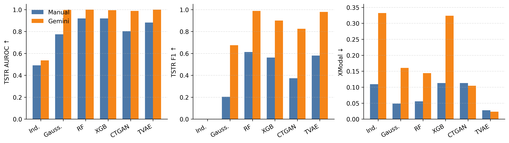

# Hierarchical Synthetic Tabular Data Generation: A Hybrid Top-Down and Bottom-Up Framework

[](https://arxiv.org/abs/2605.28198)
[](https://github.com/junfengn-ctrl/hierarchical-synthetic-tabular/actions/workflows/ci.yml)
[](LICENSE)

**Paper:** [Hierarchical Synthetic Tabular Data Generation: A Hybrid Top-Down and Bottom-Up Framework](https://arxiv.org/abs/2605.28198)

**Status:** Accepted as a poster at **FMSD @ ICML 2026**

**Authors:** Junfeng Nie, Alvin Jin, and Xiaohui Chen

This repository provides a reproducible benchmark for synthetic generation on tabular and weakly aligned text–tabular data. The framework separates top-down semantic constraints from bottom-up statistical generation: rule providers define schema and cross-modal alignment, while lower-cost generators learn local distributions and synthesize records.

## Highlights

- **Hybrid rule-guided synthesis:** combines manually specified or Gemini-generated alignment rules with statistical tabular generators.
- **Six synthesis methods:** independent sampling, Gaussian copula, random forest, XGBoost, CTGAN, and TVAE.
- **Four benchmarks:** two weakly aligned text–tabular datasets plus Adult Income and German Credit.
- **Reproducible evaluation:** repeated seeds, XGBoost ablations, TRTR/TSTR downstream utility, distributional fidelity, and cross-modal consistency.

The maintenance additions in this repository—documentation, reference result files, tests, CI, and the standalone smoke demo—do not change the paper's data preparation, synthesis, benchmark configuration, or evaluation logic.

## Results at a Glance

| benchmark | strongest fast method | TRTR AUROC | TSTR AUROC | gap |
| --- | --- | ---: | ---: | ---: |
| `weak_multimodal` | XGBoost | 0.9460 | 0.9190 | -0.0270 |
| `weak_multimodal_gemini` | Random forest | 1.0000 | 0.9998 | -0.0002 |
| `adult_income` | Random forest | 0.9063 | 0.8770 | -0.0293 |
| `german_credit` | Gaussian copula | 0.7833 | 0.7750 | -0.0083 |



The Gemini benchmark is a controlled alignment prototype: its near-perfect scores result from deliberately strict target–sentiment rules and should not be interpreted as natural multimodal generalization. Machine-readable summaries are available in [`results/`](results/).

## Setup

The repository is tested with Python 3.11. Create or activate an environment, then install dependencies:

```bash
python -m pip install -r requirements.txt
```

For the exact direct dependency versions exercised by local verification and CI, use:

```bash
python -m pip install -r requirements-tested.txt
```

Required packages are listed in `requirements.txt`:

- `pandas`
- `numpy`
- `scikit-learn`
- `xgboost`
- `sdv`

## 30-Second Smoke Demo

Run a download-free end-to-end check on a deterministic toy dataset:

```bash
python examples/smoke_demo.py
```

The demo exercises synthetic sampling, schema preservation, fidelity evaluation, leakage-safe TSTR evaluation, and artifact generation in a temporary directory. It does not modify the benchmark datasets or published result configuration.

Run the core test suite with:

```bash
python -m unittest discover -s tests -v
```

## Data

Raw and processed datasets are not tracked by git. Place the required raw CSV files under `data/raw/`, then regenerate processed files with the pipeline.

| dataset | expected path | role |
| --- | --- | --- |
| [Bank Marketing](https://archive.ics.uci.edu/dataset/222/bank+marketing) | `data/raw/bankmarketing.csv` | tabular source for weak multimodal benchmarks |
| [FinancialPhraseBank](https://arxiv.org/abs/1307.5336) | `data/raw/FinancialPhraseBank.csv` | text source for weak multimodal benchmarks |
| [Adult Income](https://archive.ics.uci.edu/dataset/2/adult) | `data/raw/adultincome.csv` | tabular benchmark |
| [German Credit](https://archive.ics.uci.edu/dataset/144/statlog+german+credit+data) | `data/raw/German_Credit_data.csv` | tabular benchmark |

Use each source under its applicable terms and rename the downloaded file to the expected path above. Generated files under `data/processed/` are local artifacts and can be recreated; compact reference results are versioned separately under `results/`.

## Quick Start

Run the default workflow from the repository root:

```bash
python src/main.py
```

This runs:

1. data preparation
2. fast repeated-seed experiments
3. XGBoost ablations
4. result plotting, if both fast and SDV summary files are available

Default settings:

| setting | value |
| --- | --- |
| synthetic rows per run | `12000` |
| seeds | `42`, `123`, `2024` |
| fast methods | `independent`, `gaussian_copula`, `random_forest`, `xgboost` |
| experiment datasets | `weak_multimodal`, `weak_multimodal_gemini`, `adult_income`, `german_credit` |
| ablation datasets | `weak_multimodal`, `weak_multimodal_gemini` |

Run individual stages:

```bash
python src/main.py prepare
python src/main.py experiments
python src/main.py ablation
python src/main.py sdv
```

Run the full workflow plus SDV baselines:

```bash
python src/main.py all --include-sdv
```

Keep per-run synthetic datasets and diagnostic files:

```bash
python src/main.py experiments --keep-run-artifacts
```

## Workflow

The pipeline runs in this order:

1. Clean configured tabular datasets.
2. Clean configured text datasets.
3. Build structured text features from FinancialPhraseBank.
4. Build two weakly aligned text-tabular benchmarks:
   - `weak_multimodal` with the manual rule provider.
   - `weak_multimodal_gemini` with the Gemini-generated rule provider.
5. Generate synthetic datasets with baseline and conditional synthesis methods.
6. Evaluate fidelity against the real benchmark data.
7. Evaluate downstream utility using train-synthetic-test-real performance.
8. Aggregate repeated-seed results and XGBoost ablations.

Equivalent step-by-step commands:

```bash
python src/main.py prepare
python src/run_experiments.py --datasets weak_multimodal,weak_multimodal_gemini,adult_income,german_credit --methods independent,gaussian_copula,random_forest,xgboost --seeds 42,123,2024 --n-rows 12000 --output-dir data/processed/experiments
python src/ablate_xgboost.py --datasets weak_multimodal,weak_multimodal_gemini --seeds 42,123,2024 --n-rows 12000 --output-dir data/processed/xgboost_ablation
```

Run SDV baselines separately:

```bash
python src/main.py sdv
```

The result comparison plot is generated automatically after `experiments`, `sdv`, or `all` when both required summary files exist:

- `data/processed/experiments/experiment_summary.csv`
- `data/processed/experiments_sdv/experiment_summary.csv`

The default plot output is:

- `data/processed/result_comparison.png`

Regenerate only the plot:

```bash
python src/plot_result_comparison.py --output data/processed/result_comparison.png
```

## Benchmarks

| benchmark | source | description |
| --- | --- | --- |
| `weak_multimodal` | Bank Marketing + FinancialPhraseBank | weakly aligned text-tabular benchmark built with manual top-down rules |
| `weak_multimodal_gemini` | Bank Marketing + FinancialPhraseBank | weakly aligned text-tabular benchmark built with a Gemini-generated rule-provider config |
| `adult_income` | Adult Income | tabular binary classification benchmark |
| `german_credit` | German Credit | tabular binary classification benchmark |

Manual rule provider:

```text
target=0 -> neutral, negative
target=1 -> positive, neutral
```

Gemini-generated rule provider:

```text
target=0 -> neutral, negative
target=1 -> positive
```

Gemini is used only to generate the top-down rule-provider JSON from a compact dataset summary. Synthetic rows are generated by the bottom-up synthesis methods, not by Gemini.

## Methods

| method | script | description |
| --- | --- | --- |
| `independent` | `src/baseline_independent_sampling.py` | samples each column independently |
| `gaussian_copula` | `src/baseline_gaussian_copula.py` | low-compute rank Gaussian copula baseline |
| `random_forest` | `src/baseline_random_forest.py` | sequential conditional synthesis with RandomForest models |
| `xgboost` | `src/synth_xgboost.py` | sequential conditional synthesis with XGBoost models |
| `ctgan` / `tvae` | `src/baseline_sdv.py` | SDV neural baselines |

## Configuration

| file | purpose |
| --- | --- |
| `configs/tabular_datasets.json` | tabular raw paths, output paths, target mappings, and missing-value rules |
| `configs/text_datasets.json` | text raw paths, output paths, feature paths, text columns, label columns, and label mappings |
| `configs/experiment_datasets.json` | benchmark names and processed CSV paths used by experiment runners |
| `configs/rule_provider_default.json` | manual top-down weak alignment rules |
| `configs/rule_provider_gemini.json` | Gemini-generated top-down weak alignment rules |
| `configs/rule_provider_gemini_provenance.md` | Gemini prompt provenance |

## Evaluation

The experiment runners evaluate each synthetic dataset with utility and fidelity metrics. Utility is implemented in `src/evaluate_utility.py`; fidelity is implemented in `src/evaluate_fidelity.py`.

Utility evaluation uses a downstream binary classification task with `target` as the label. Before training, direct label-leakage columns are removed from the feature matrix. For example, when the target column is `target`, raw label columns such as `y`, `salary`, and `credit_risk` are excluded if present.

The real dataset is split into train and test partitions using a 75/25 stratified split:

- `X_real_train`, `y_real_train`: real training data
- `X_real_test`, `y_real_test`: held-out real test data

The same held-out real test split is used for both TRTR and TSTR.

TRTR means train-real-test-real:

1. Train a logistic regression model on `X_real_train`, `y_real_train`.
2. Evaluate it on `X_real_test`, `y_real_test`.
3. Treat the result as the real-data reference performance.

TSTR means train-synthetic-test-real:

1. Train the same logistic regression pipeline on the synthetic dataset.
2. Evaluate it on the same held-out real test set, `X_real_test`, `y_real_test`.
3. Use this result as the primary downstream utility score for the synthetic data.

The logistic regression pipeline uses:

- categorical features: most-frequent imputation and one-hot encoding
- numeric features: median imputation and standard scaling
- classifier: `LogisticRegression(max_iter=1000, solver="liblinear")`

Utility metrics are:

- `accuracy`
- `f1`
- `auroc`

The utility report contains three settings:

| setting | meaning |
| --- | --- |
| `train_real_test_real` | TRTR reference performance |
| `train_synthetic_test_real` | TSTR synthetic-data utility |
| `gap_tstr_minus_trtr` | TSTR minus TRTR for each metric |

Gap metrics are computed as:

```text
gap_accuracy = tstr_accuracy - trtr_accuracy
gap_f1      = tstr_f1      - trtr_f1
gap_auroc   = tstr_auroc   - trtr_auroc
```

Gaps closer to zero indicate that training on synthetic data is closer to training on real data. Negative gaps are common because synthetic data usually loses some predictive information relative to real data.

If a synthetic dataset collapses to a single target class, the evaluator uses a constant classifier instead of failing the run. This keeps the experiment complete while still assigning poor utility to collapsed synthetic data.

Fidelity evaluation compares real and synthetic data distributions:

| metric | meaning |
| --- | --- |
| `mean_numeric_abs_mean_diff` | average absolute difference in numeric column means |
| `mean_numeric_abs_std_diff` | average absolute difference in numeric column standard deviations |
| `mean_categorical_tvd` | average total variation distance across categorical columns |
| `mean_cross_modal_abs_diff` | average difference in target-text sentiment alignment for weak multimodal benchmarks |

For repeated-seed experiments, `experiment_results.csv` stores one row per dataset, method, and seed. `experiment_summary.csv` groups those rows by dataset and method, then reports mean and standard deviation across seeds. XGBoost ablation files use the same logic, grouped by dataset and ablation setting.

## Outputs

Main experiments:

- `data/processed/experiments/experiment_results.csv`
- `data/processed/experiments/experiment_summary.csv`

XGBoost ablation:

- `data/processed/xgboost_ablation/xgboost_ablation_results.csv`
- `data/processed/xgboost_ablation/xgboost_ablation_summary.csv`

SDV baselines:

- `data/processed/experiments_sdv/experiment_results.csv`
- `data/processed/experiments_sdv/experiment_summary.csv`

Result comparison figure:

- `data/processed/result_comparison.png`

Result file structure:

| file | row level | contents |
| --- | --- | --- |
| `experiment_results.csv` | one row per `dataset` / `method` / `seed` | TRTR reference metrics, TSTR utility metrics, TSTR-minus-TRTR gaps, and fidelity summaries |
| `experiment_summary.csv` | one row per `dataset` / `method` | mean/std aggregation across seeds |
| `xgboost_ablation_results.csv` | one row per `dataset` / `ablation` / `seed` | focused XGBoost ablation results |
| `xgboost_ablation_summary.csv` | one row per `dataset` / `ablation` | mean/std aggregation across seeds |

Utility columns:

- `trtr_accuracy`, `trtr_f1`, `trtr_auroc`: train on real data, test on real data.
- `tstr_accuracy`, `tstr_f1`, `tstr_auroc`: train on synthetic data, test on real data.
- `gap_accuracy`, `gap_f1`, `gap_auroc`: TSTR minus TRTR, where TRTR is train on real data and test on real data.

Fidelity columns:

- `mean_numeric_abs_mean_diff`
- `mean_numeric_abs_std_diff`
- `mean_categorical_tvd`
- `mean_cross_modal_abs_diff`

By default, per-run synthetic datasets, fidelity reports, utility reports, and metadata files are stored in temporary directories and removed after aggregation. Use `--keep-run-artifacts` to keep them. The `results/` directory contains the compact reference CSV files used for the tables in this README.

## Results

The tables below summarize one regenerated local run. Compact reference CSVs are versioned under [`results/`](results/); regenerate them locally to verify the workflow or compare a changed configuration.

Unless otherwise stated, accuracy, F1, and AUROC in the result tables are TSTR metrics: models are trained on synthetic data and evaluated on held-out real data. `TRTR AUROC` is included as a real-data reference, and `gap AUROC` is computed as `TSTR AUROC - TRTR AUROC`.

TRTR is the real-data reference for each dataset and is repeated across methods for readability.

Fast repeated-seed experiments:

| dataset | strongest fast method by TSTR AUROC | TRTR AUROC | TSTR AUROC | gap AUROC | TSTR F1 | TSTR accuracy |
| --- | --- | ---: | ---: | ---: | ---: | ---: |
| `weak_multimodal` | `xgboost` | `0.9460` | `0.9190` | `-0.0270` | `0.5621` | `0.9139` |
| `weak_multimodal_gemini` | `random_forest` | `1.0000` | `0.9998` | `-0.0002` | `0.9878` | `0.9971` |
| `adult_income` | `random_forest` | `0.9063` | `0.8770` | `-0.0293` | `0.3914` | `0.8098` |
| `german_credit` | `gaussian_copula` | `0.7833` | `0.7750` | `-0.0083` | `0.8336` | `0.7253` |

Weak multimodal benchmarks:

| dataset | method | TRTR AUROC | TSTR AUROC | gap AUROC | TSTR F1 | TSTR accuracy | cross-modal diff |
| --- | --- | ---: | ---: | ---: | ---: | ---: | ---: |
| `weak_multimodal` | `xgboost` | `0.9460` | `0.9190` | `-0.0270` | `0.5621` | `0.9139` | `0.1127` |
| `weak_multimodal` | `random_forest` | `0.9460` | `0.9188` | `-0.0272` | `0.6122` | `0.9281` | `0.0555` |
| `weak_multimodal` | `gaussian_copula` | `0.9460` | `0.7738` | `-0.1722` | `0.2034` | `0.8949` | `0.0485` |
| `weak_multimodal` | `independent` | `0.9460` | `0.4905` | `-0.4555` | `0.0000` | `0.8830` | `0.1094` |
| `weak_multimodal_gemini` | `random_forest` | `1.0000` | `0.9998` | `-0.0002` | `0.9878` | `0.9971` | `0.1437` |
| `weak_multimodal_gemini` | `gaussian_copula` | `1.0000` | `0.9968` | `-0.0032` | `0.6749` | `0.9423` | `0.1605` |
| `weak_multimodal_gemini` | `xgboost` | `1.0000` | `0.9948` | `-0.0052` | `0.9003` | `0.9746` | `0.3234` |
| `weak_multimodal_gemini` | `independent` | `1.0000` | `0.5359` | `-0.4641` | `0.0000` | `0.8830` | `0.3320` |

XGBoost ablation:

| dataset | best ablation by TSTR AUROC | TRTR AUROC | TSTR AUROC | gap AUROC | TSTR F1 | TSTR accuracy |
| --- | --- | ---: | ---: | ---: | ---: | ---: |
| `weak_multimodal` | `condition_cols_12` | `0.9460` | `0.9190` | `-0.0270` | `0.5621` | `0.9139` |
| `weak_multimodal_gemini` | `condition_cols_4` | `1.0000` | `0.9999` | `-0.0001` | `0.9690` | `0.9925` |

SDV baselines use one seed by default, so standard deviation columns are blank:

| dataset | method | TRTR AUROC | TSTR AUROC | gap AUROC | TSTR F1 | TSTR accuracy |
| --- | --- | ---: | ---: | ---: | ---: | ---: |
| `weak_multimodal` | `tvae` | `0.9449` | `0.8815` | `-0.0634` | `0.5802` | `0.8932` |
| `weak_multimodal` | `ctgan` | `0.9449` | `0.8034` | `-0.1415` | `0.3737` | `0.8971` |
| `weak_multimodal_gemini` | `tvae` | `1.0000` | `0.9995` | `-0.0005` | `0.9782` | `0.9948` |
| `weak_multimodal_gemini` | `ctgan` | `1.0000` | `0.9882` | `-0.0118` | `0.8248` | `0.9620` |
| `adult_income` | `tvae` | `0.9061` | `0.8729` | `-0.0331` | `0.6548` | `0.8036` |
| `adult_income` | `ctgan` | `0.9061` | `0.8699` | `-0.0362` | `0.5939` | `0.8235` |
| `german_credit` | `tvae` | `0.7955` | `0.5000` | `-0.2955` | `0.8235` | `0.7000` |
| `german_credit` | `ctgan` | `0.7955` | `0.3883` | `-0.4072` | `0.8235` | `0.7000` |

Interpretation:

- Lower cross-modal diff means the synthetic data better preserves the target-text sentiment alignment in the weak multimodal benchmark.
- Independent sampling is weak for downstream utility because it does not preserve cross-column dependencies. On `weak_multimodal`, it has `0.8830` TSTR accuracy because the negative class is the majority class, but its `0.0000` F1 and near-random AUROC show that it does not learn the positive class.
- The `weak_multimodal_gemini` TRTR values are `1.0000` because the Gemini-generated rule creates a strict alignment: `target=1` is paired only with positive text, while `target=0` is paired with neutral or negative text. This should be interpreted as a controlled alignment prototype rather than a claim about natural multimodal data.
- `german_credit` often shows `0.7000` TSTR accuracy and `0.8235` F1 because its positive class is 70% of the data. A method can achieve those values by mostly predicting the majority class, so AUROC is important for judging whether it truly ranks positive and negative cases.
- `NaN` values are expected in two cases: SDV standard deviations are blank because SDV runs use one seed by default, and cross-modal fidelity is blank for tabular-only datasets because they do not contain text alignment.
- Conditional tree-based methods are substantially stronger than independent sampling on the weak multimodal benchmarks. The strongest method still varies across datasets, so the project is best framed as a benchmark workflow for hybrid rule-guided synthetic data rather than a single-method claim.

## Adding Datasets

Add a tabular dataset:

1. Put the raw CSV under `data/raw/`.
2. Add an entry to `configs/tabular_datasets.json`.
3. Add the cleaned output path to `configs/experiment_datasets.json` if it should be included in experiments.
4. Run `python src/main.py prepare`.
5. Run `python src/main.py experiments --datasets your_dataset_name`.

Add a text dataset:

1. Put the raw CSV under `data/raw/`.
2. Add an entry to `configs/text_datasets.json`.
3. Run `python src/prepare_text_dataset.py your_text_dataset_name`.
4. Run `python src/build_text_features.py your_text_dataset_name`.

Add a weak multimodal benchmark:

1. Create or edit a rule-provider JSON under `configs/`.
2. Run `src/build_weak_alignment.py` with `--tabular-csv`, `--text-feature-csv`, `--output-csv`, and `--rule-config`.
3. Add the benchmark output path to `configs/experiment_datasets.json`.

## Repository Layout

```text
configs/
  JSON configuration for datasets, experiment inputs, and rule providers.
.github/workflows/
  Continuous-integration checks for Python 3.11.
assets/
  Figures displayed in this README.
data/
  raw/
    Local raw datasets. CSV files are ignored by git.
  processed/
    Local generated datasets, synthetic outputs, and reports. Ignored by git.
examples/
  Download-free smoke demo using a deterministic toy dataset.
results/
  Versioned reference summaries and per-seed benchmark results.
src/
  Preprocessing, synthesis, evaluation, ablation, and experiment runners.
tests/
  Core behavior, reproducibility, leakage, fidelity, and CLI checks.
requirements.txt
  Direct Python dependencies.
requirements-tested.txt
  Direct dependency versions verified locally and in CI.
```

## Script Reference

Data preparation:

- `src/prepare_tabular_dataset.py`: cleans configured tabular datasets and creates the binary `target` column.
- `src/prepare_text_dataset.py`: cleans configured text datasets and creates basic text statistics.
- `src/build_text_features.py`: builds text-derived structured features using TF-IDF, SVD, and lexical counts.
- `src/build_weak_alignment.py`: builds weakly aligned text-tabular benchmarks using a rule provider.

Synthesis methods:

- `src/baseline_independent_sampling.py`
- `src/baseline_gaussian_copula.py`
- `src/baseline_random_forest.py`
- `src/baseline_sdv.py`
- `src/synth_xgboost.py`

Evaluation:

- `src/evaluate_fidelity.py`: compares numeric, categorical, and cross-modal summaries.
- `src/evaluate_utility.py`: compares `train_real_test_real` and `train_synthetic_test_real` performance using a logistic regression downstream model.

Experiment execution:

- `src/main.py`: runs the project workflow from one command.
- `src/run_experiments.py`: runs datasets, synthesis methods, and seeds into detailed and summary result tables.
- `src/ablate_xgboost.py`: runs focused XGBoost ablations.
- `src/plot_result_comparison.py`: generates the weak multimodal comparison plot from experiment summary CSV files.

Supporting utilities:

- `src/config_utils.py`
- `src/rule_provider.py`
- `src/tune_xgboost.py`

## Citation

If you use this code or build on this work, please cite:

```bibtex
@misc{nie2026hierarchical,
  title     = {Hierarchical Synthetic Tabular Data Generation: A Hybrid Top-Down and Bottom-Up Framework},
  author    = {Nie, Junfeng and Jin, Alvin and Chen, Xiaohui},
  year      = {2026},
  eprint    = {2605.28198},
  archivePrefix = {arXiv},
  primaryClass  = {cs.LG},
  doi       = {10.48550/arXiv.2605.28198},
  url       = {https://arxiv.org/abs/2605.28198},
  note      = {Accepted as a poster at FMSD @ ICML 2026},
}
```

## License

This project is released under the MIT License. See [`LICENSE`](LICENSE) for details.
